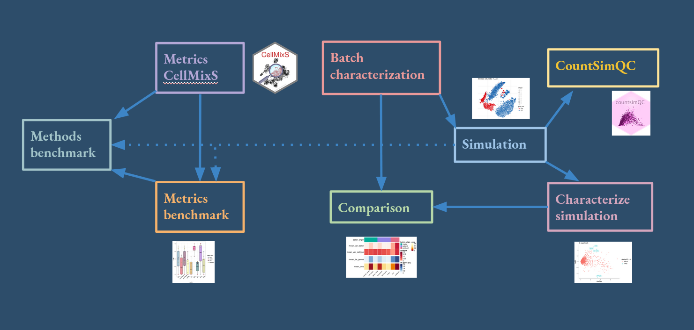

```{r setup, include=FALSE}
knitr::opts_chunk$set(echo = TRUE)
```

## Benchmark metrics for batch mixing 

A key step in single cell RNAseq analysis is data integration from different experimental sources. 
Althought a variety of methods have been developed to integrate datasets and correct for batch effects,
their performance can vary between datasets and kind of bias. Thus it is important to:  
+ Understand the **underlying (batch-) structure** of the dataset.
+ Check the **performance of an integration method** before using the result downstream.
  

Several metrics have been developed or suggested to quantify the **mixing of a certain variable within a dataset**.
These are mainly applied within benchmark studies for scRNA-seq integration tools 
[(Luecken et al, 2020)](https://www.biorxiv.org/content/10.1101/2020.05.22.111161v2), 
[(Tran et al., 2020)](https://genomebiology.biomedcentral.com/articles/10.1186/s13059-019-1850-9),
but are similar applicable within a standard single cell pipeline. A variety of them has been made available
via the [CellMixS](https://www.bioconductor.org/packages/release/bioc/html/CellMixS.html) R package.

While these metrics target the same problem of quantifying the batch effect/bias within the data, 
their results diverge substantially within benchmakrk studies, even on the same data 
(see [(Luecken et al, 2020)](https://www.biorxiv.org/content/10.1101/2020.05.22.111161v2), 
[(Tran et al., 2020)](https://genomebiology.biomedcentral.com/articles/10.1186/s13059-019-1850-9)).
Here we aim to understand differences, strength, weaknesses and correlations between metrics to quantify batch effects.
The latter is motivated by the fact, that benchmark studies often use the mean performance 
within a variety of metrics to rank methods. While this makes the final ranking more stable for 
single metrics preferences, this can also be skewed by correlated metrics.


