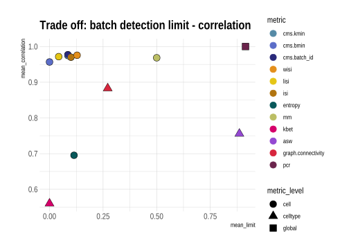

```{r setup, include=FALSE}
knitr::opts_chunk$set(echo = TRUE)
```

## Benchmark task for metric comparison 

We created different benchmark tasks to understand the usability and performance 
of different mixing metrics. This is used to make an informed choice of metrics used in 
the batch correction method's benchmark and can be applied within standard scRNAseq analysis pipelines.

Key __questions__ we wanted to target within this benchmark are: 

+ How well can different metrics quantify batch effects in a scalable way?  
+ How sensitive are metrics in detecting batch effects?  
+ Are metrics affected by unbalanced batches with equally strong batch effects, but different batch abundances? 
+ How do metrics scale with randomness? 
+ How much do metrics correlate?  

We created the following __tasks__ to answer these questions:  

+ **1. Test the [correspondence of metric scores with batch strength associated dataset features](batch_characteristics_metrics.html).**  
We compared the *variance explained by the batch* and the *number of differentially expressed genes* between batches of a variety of real datasets with different known sources of batch effects and different batch types as characterized [here](https://almutlue.github.io/batch_snakemake/batch_index.html) with the metrics scores.  

+ **2. Test the metrics ability to detect randomness in a dataset with a [moderate](metric_scaling_random_pbmc_roche.html) and a [strong](metric_scaling_random_csf_patient_random.html) batch effect.**  
We wanted to test the metrics scaling with increases randomness regarding the batch effect. This serves as a negative control as metrics should report no batch effect, if batch labels are distributed randomly. To do so we randomly permute an increasing number of batch label from 0% - 100% without touching the underlying data. 
  
+ **3. Test [scaling and batch detection limits of metrics with simulated batch effects with increased batch strength](metric_scaling_simulations.html).**  
We simulated batch effects by estimating parameter from real datasets with batch effects trying to meet all important batch characteristics. Using a scaling parameter we increased the celltype-specific batch effect logFC gradually and compared the metrics scaling with this increase as well as when different metrics started to diverge by more than 10 percent from their score at random settings within the very same dataset. Simulations, comparisons to real data with regards to count and batch characteristics can be found [here](https://almutlue.github.io/batch_snakemake/simulation_index.html).  
  
+ **3. Test [the metrics robustness towards unbalanced datasets](metric_scaling_unbalanced.html).**  
We wanted to see how metrics can handle batch effects with unequal number of cells per batch. We consider a batch effect having the the same strength if cells are distributed equally, but differently abundant. These metrics should pick up random mixing not differential abundance (which can, but does not need to be associated with a batch effect and can/should not be accounted for by data integration). So the metrics should be stable towards random removal of cells from one batch without changing the strength of the batch bias itself. Here we gradually remove random cells from one batch and celltype and meassure the stability of the overall metrics score.  
  
+ **5. Evaluate the metrics [CPU time and memory consumption by number of cells and genes](evaluate_time_data.html).**  
We evaluated CPU time (User time + system time) and memory usage (maximum resident set size: RSS) in two synthetic datasets with different number of cells (68472 and 80768) and genes (8331 and 23381). We downsampled datasets in steps of 20% to explore run times and memory usage according to the number of cells 





