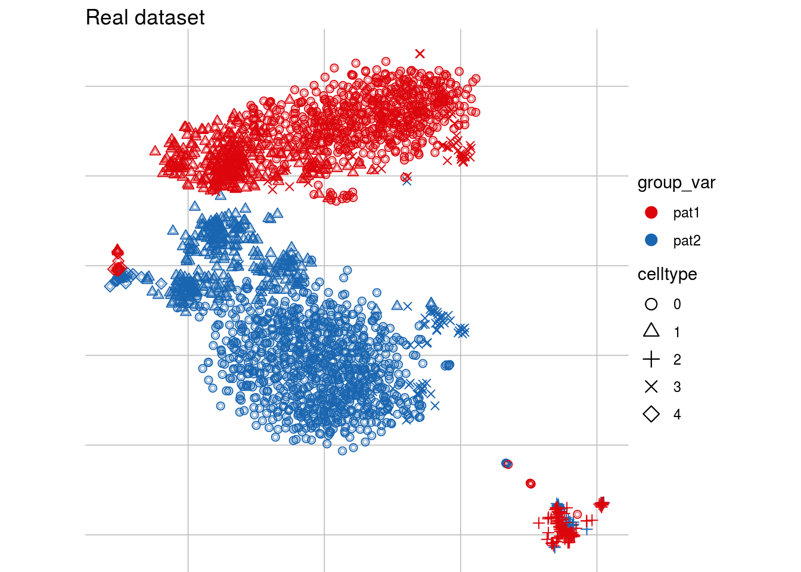
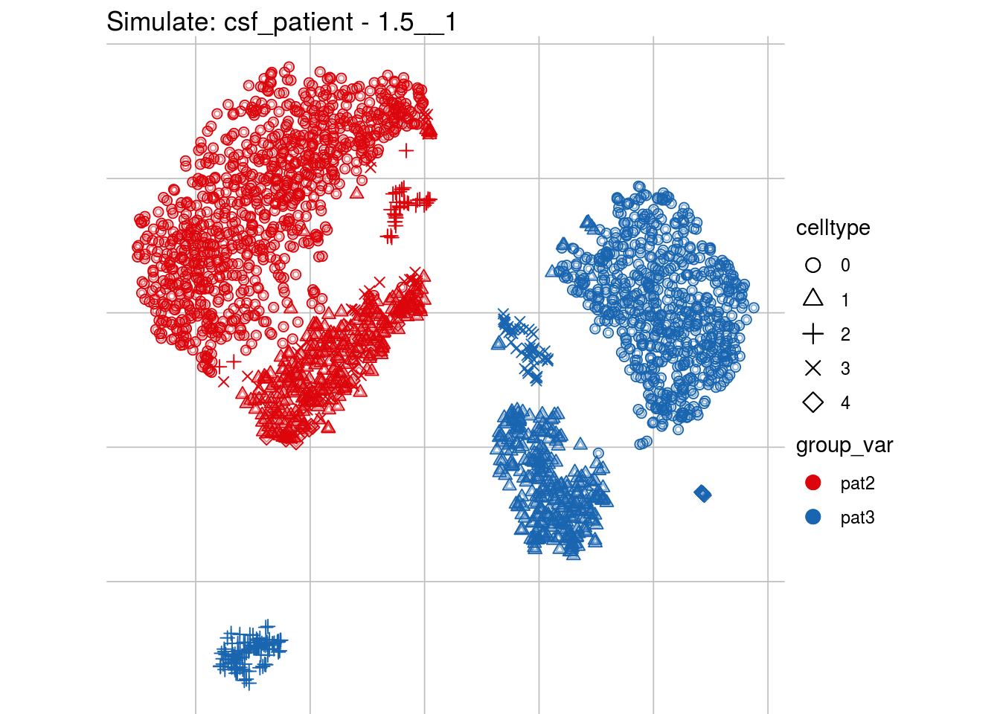

```{r setup, include=FALSE}
knitr::opts_chunk$set(echo = TRUE)
```

## Batch characterisation and simulation of realistic batch effects

To create realistic benchmark tasks it's important to understand main characteristics of real data batch effects.
This is why we [characterised batch effects from 9 different real data batch scenarios](https://almutlue.github.io/batch_snakemake/index.html) with focus on **batch strength**,
**celltype-specificity** and **batch type**. We used these insights to (simulate realistic batch effects)[https://almutlue.github.io/batch_snakemake/simulation_index.html], with celltype specific logFC distributions, while retaining covariance structure between them. 


