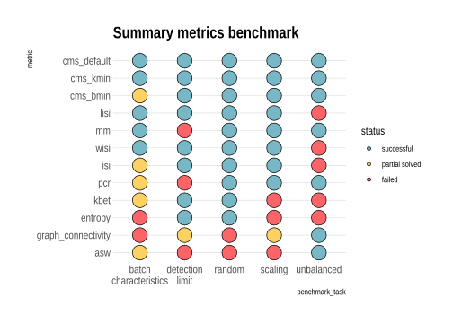

```{r setup, include=FALSE}
knitr::opts_chunk$set(echo = TRUE)
```

## Summary

One of the most important finding here was that different metrics although all used to quantify batch effects in scRNAseq and used interchangeable can differ substantially in their performance. While one could argue to use a variety of metrics to get a stable overall result, this is not feasible in current scRNAseq standard pipelines and understanding where metrics differ and where metrics breaks will give us a better resolution and more interpretable results. This is important as a benchmark can not aim for one overall final recommendation/ranking as it doesn't cover all possible task. This is why we aim to select a set of intuitively interpretable metrics and clear defined benchmark tasks.  
  
This also means that these [results](summary_results.html) can not give a final overall ranking/recommendation on mixing metrics, but are thought to show which metric perform well in certain important tasks. Although the order reflects the overall performance within these task, this is subjected to more or less arbitrary thresholds. Thus we encourage people to look more into our detailed results to make an informed decision.  
  
In general we find that within the limits of this benchmark **cellspecific metrics** perform favorable. They also have the advantage of being independent of prior clustering choices and can resolve local structures, which can give key insights.

