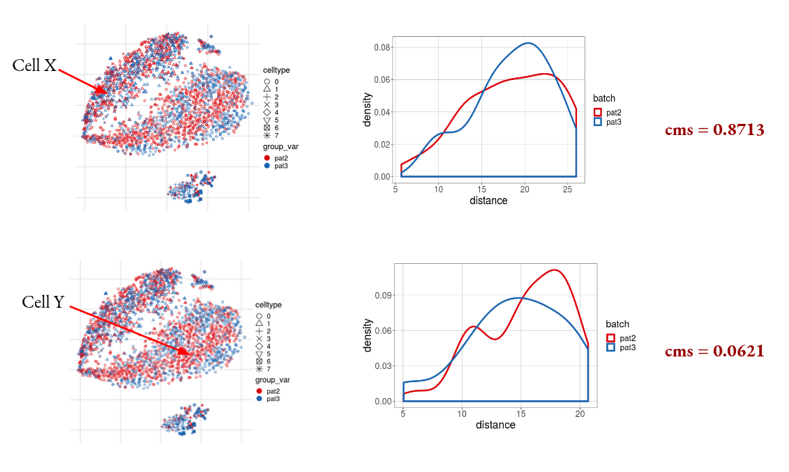

```{r setup, include=FALSE}
knitr::opts_chunk$set(echo = TRUE)
```

## Cellspecific Mixing Score (cms)

Metric that tests for each cell the hypothesis that batch-specific distance distributions towards it’s k-nearest neighbouring (knn) cells are derived from the same unspecified underlying distribution using the Anderson-Darling test (Scholz and Stephens 1987).
These distance distributions are independent of the number of cells per batch. The score can be interpreted as the
data's probability within an equally mixed neighborhood according to the batch variable. A randomly distributed batch variable results in a flat distributed p.value histogram. The cms score is available within the Bioconductor [CellMixS](https://www.bioconductor.org/packages/release/bioc/html/CellMixS.html) R package.



