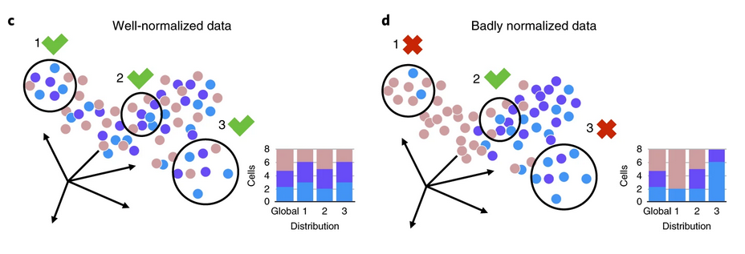

```{r setup, include=FALSE}
knitr::opts_chunk$set(echo = TRUE)
```

## K-nearest neighbour batch effect test (kBET)

A test for batch effects specifically in high-dimensional single-cell RNA sequencing data. 
It evaluates the accordance of replicates based on Pearson's $\chi^2$ test. 
First, the algorithm creates k-nearest neighbour matrix and choses 10% of the 
samples to check the batch label distribution in its neighbourhood. 
If the local batch label distribution is sufficiently similar to the global batch label 
distribution, the $\chi^2$-test does not reject the null hypothesis
(that is "all batches are well-mixed"). The neighbourhood size k is fixed for all tests. 
Next, the test returns a binary result for each of the tested samples. 
Finally, the result of kBET is the average test rejection rate. 
The lower the test result, the less bias is introduced by the batch effect. 
As batch proportions can be different between celltypes we here run kBET for each celltype individually. 
The final mean score is the mean score proportional to the number ofcells per 
celltype (comparable with the mean of the cellspecific metrics). 
kBet has been proposed by [Buettner et. al., 2019](https://www.nature.com/articles/s41592-018-0254-1) 
and is available as [R package on github](https://github.com/theislab/kBET).




