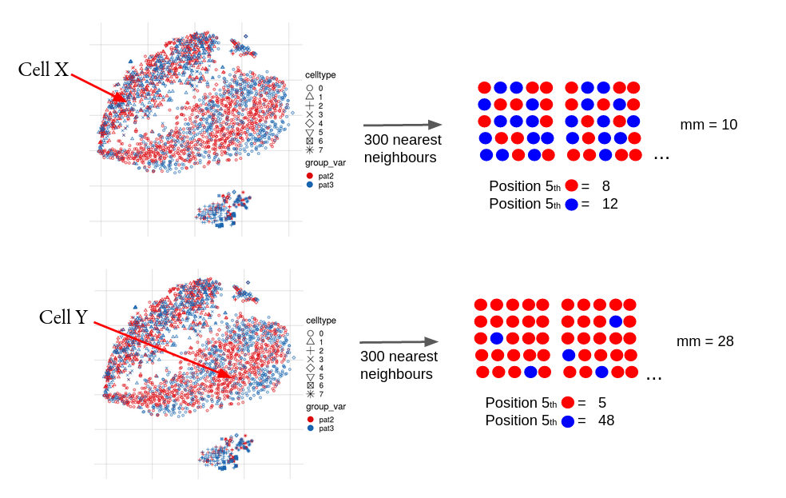

```{r setup, include=FALSE}
knitr::opts_chunk$set(echo = TRUE)
```

## Seurat's mixing metric (mm)

Metric using the median position of the *kth cell* from each batch within its *k-nearest neighbours (knn)* as a score.
In general the lower the metrics score the better mixed is the neighbourhood, but it's absolute range effectivly depends on the number of batches, k and the size of knn, e.g. even with constant k (default = 5) and constant size of knn (default = 300) the metric's minimum is 10 for a dataset with 3 batches and 15 for a dataset with 5 batches. This makes it less suitable for an across dataset comparison, but still valid for within dataset compartisons.   
  
The mixing metric has been suggested by [Stuart et al., 2018](https://www.cell.com/cell/fulltext/S0092-8674(19)30559-8) and is available in the [Seurat](https://satijalab.org/seurat/) R package as well as in the Bioconductor [CellMixS](https://www.bioconductor.org/packages/release/bioc/html/CellMixS.html) R package.



